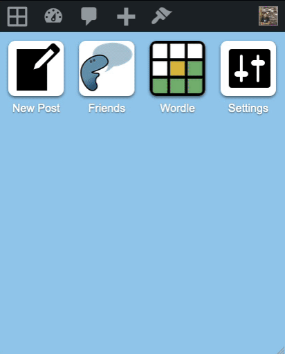
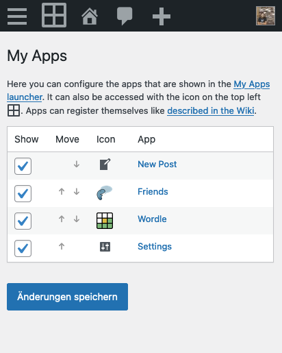
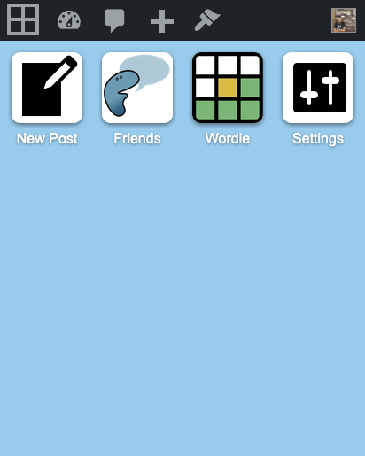

# My Apps

- Contributors: akirk
- Tags: apps
- Requires at least: 5.0
- Tested up to: 6.5
- License: GPL-2.0-or-later
- Stable tag: 1.0.0

A WordPress app launcher.

## Description

Plugins that act like local apps can register to be shown in this launcher.



### Screenshots





### Code Example

```php

add_filter( 'my_apps_plugins', function ( $apps ) {
    // Add your app to the array. These three keys are mandatory:
    $apps['friends'] = array(
        // Name: The name that will be displayed.
        'name'     => __( 'Friends', 'friends' ),
        // The icon as a URL. You can also use a local URL inside a plugin, using `plugins_url()`.
        'icon_url' => 'https://ps.w.org/friends/assets/icon-256x256.png',
        // The URL this should link to.
        'url'      => home_url( '/friends/' ),
    );
    return $apps;
} );
```

